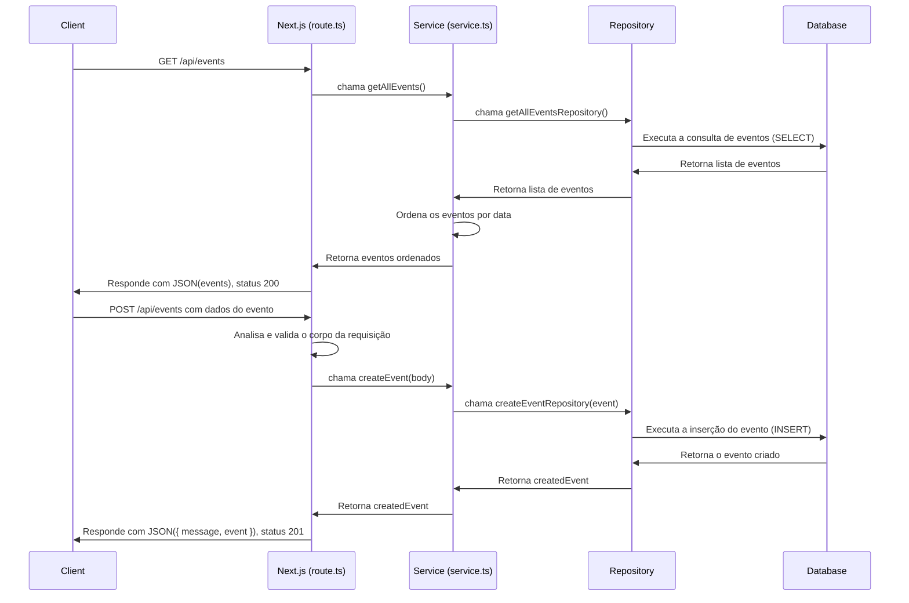

# 📝 Documentação para route.ts

## Visão Geral

Este arquivo atua como um manipulador de rotas de API (API Route Handler) para uma aplicação Next.js. Sua principal responsabilidade é expor endpoints HTTP para gerenciar recursos de "Eventos". Ele lida com as requisições HTTP de entrada, delega a lógica de negócio para a camada de serviço (`service.ts`) e formata as respostas HTTP (seja de sucesso ou de erro) para o cliente.

As diretivas `export const dynamic = 'force-dynamic';` e `export const revalidate = 0;` garantem que esta rota seja renderizada dinamicamente a cada requisição, desativando qualquer tipo de cache estático ou de dados.

## Funções Exportadas

### `GET()`

Esta função assíncrona manipula requisições `GET` para o endpoint.

- **Propósito:** Buscar e retornar uma lista de todos os eventos.
- **Fluxo de Execução:**
    1. Invoca a função `getAllEvents()` do arquivo `service.ts` para obter os dados dos eventos.
    2. Em caso de sucesso, a função do serviço retorna uma lista de eventos, que é então enviada como uma resposta JSON com o status HTTP `200 OK`.
    3. Se ocorrer um erro durante a busca (por exemplo, falha na comunicação com o banco de dados), o bloco `catch` captura a exceção e retorna uma resposta de erro em JSON com a mensagem "Failed to fetch events" e o status HTTP `500 Internal Server Error`.

### `POST(request: NextRequest)`

Esta função assíncrona manipula requisições `POST` para o endpoint.

- **Propósito:** Criar um novo evento com base nos dados fornecidos no corpo da requisição.
- **Parâmetros:**
  - `request`: Um objeto `NextRequest` que contém os detalhes da requisição HTTP, incluindo o corpo (body) em formato JSON. O corpo deve estar no formato do tipo `EventBody` (`{ name: string; date: string; flyer: string; }`).
- **Fluxo de Execução:**
    1. Extrai e analisa o corpo da requisição (`body`) como JSON.
    2. Realiza uma validação básica para garantir que os campos obrigatórios `name` e `date` estejam presentes. Se algum estiver faltando, retorna uma resposta de erro em JSON com o status HTTP `400 Bad Request`.
    3. Se a validação for bem-sucedida, invoca a função `createEvent(body)` do arquivo `service.ts`, passando os dados do novo evento para a camada de serviço.
    4. Após a criação bem-sucedida, retorna uma resposta em JSON com uma mensagem de sucesso, o objeto do evento criado (`createdEvent`) e o status HTTP `201 Created`.
    5. Se ocorrer um erro durante o processo de criação, o bloco `catch` captura a exceção e retorna uma resposta de erro em JSON com a mensagem "Failed to create event" e o status HTTP `500 Internal Server Error`.

## Diagrama de Sequência

