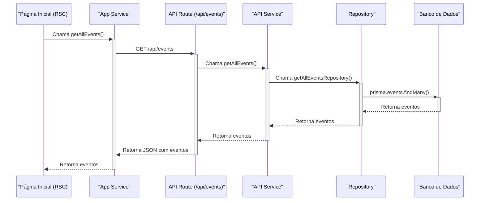

```mermaid
sequenceDiagram
    participant Page as "Página Inicial (RSC)"
    participant AppService as "App Service"
    participant API as "API Route (/api/events)"
    participant ApiService as "API Service"
    participant Repository as "Repository"
    participant DB as "Banco de Dados"

    Page->>+AppService: Chama getAllEvents()
    AppService->>+API: GET /api/events
    API->>+ApiService: Chama getAllEvents()
    ApiService->>+Repository: Chama getAllEventsRepository()
    Repository->>+DB: prisma.events.findMany()
    DB-->>-Repository: Retorna eventos
    Repository-->>-ApiService: Retorna eventos
    ApiService-->>-API: Retorna eventos
    API-->>-AppService: Retorna JSON com eventos
    AppService-->>-Page: Retorna eventos
```
